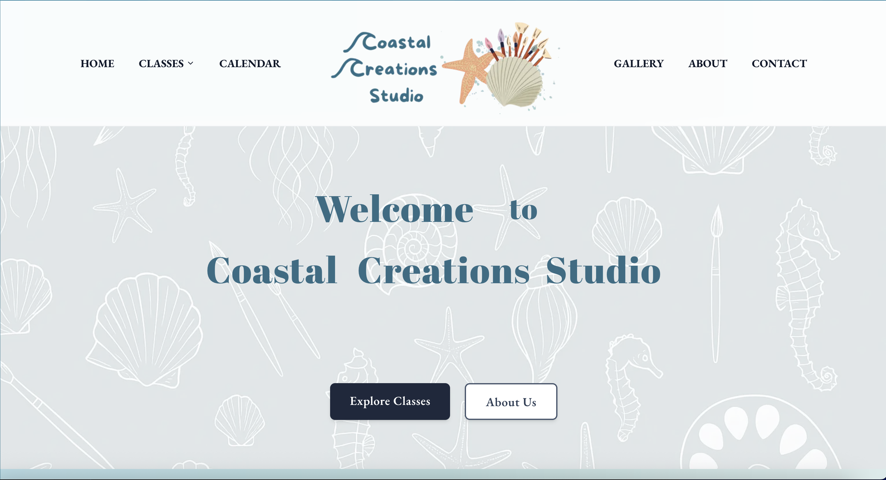
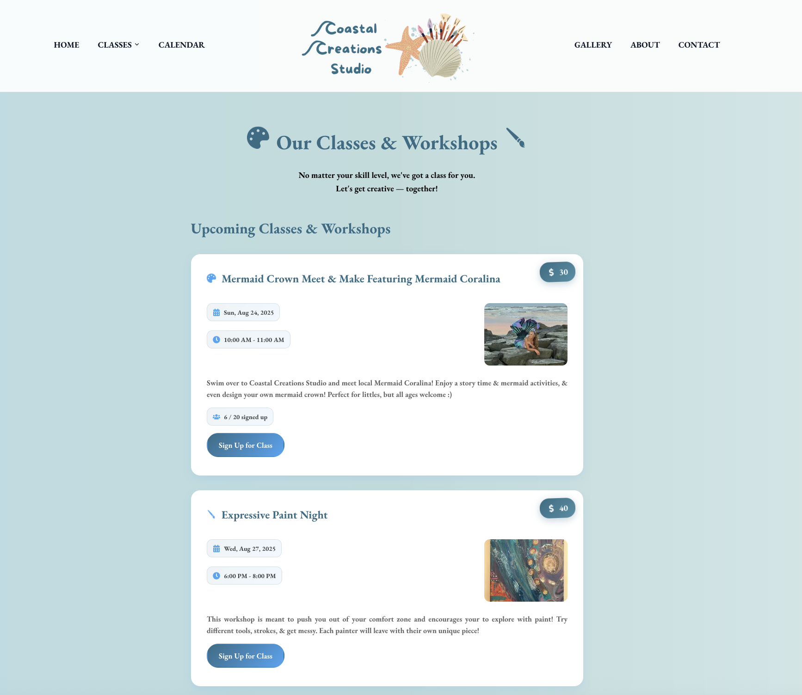
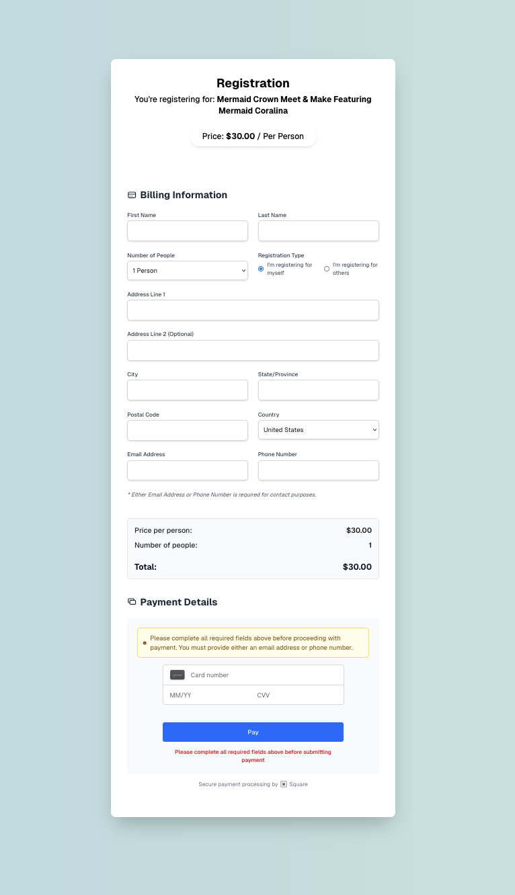
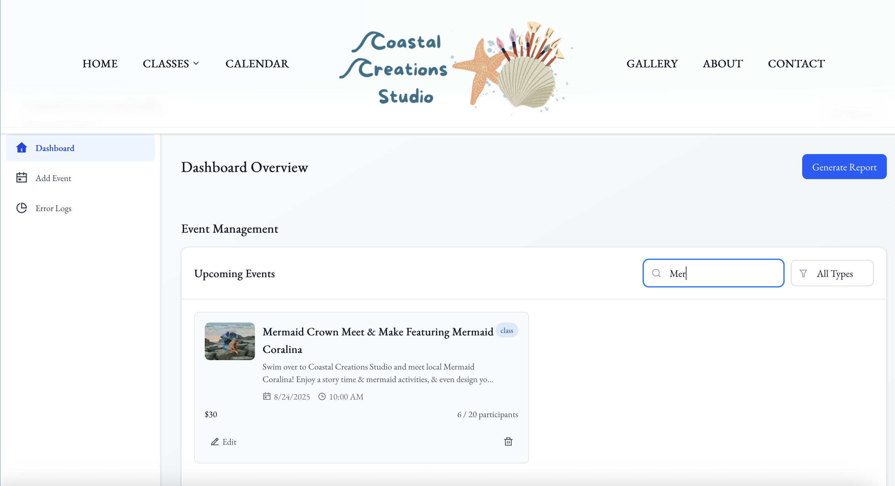
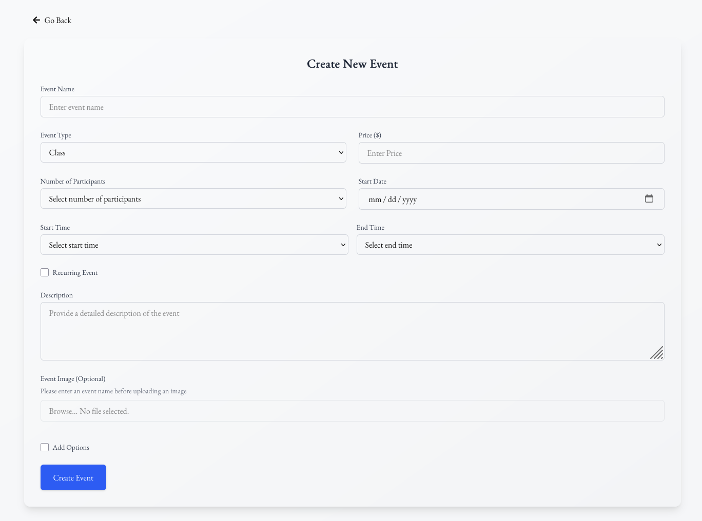

# Coastal Creations Studio

## About

Coastal Creations Studio is a vibrant art studio maintained by Ashley Mathers, offering a variety of creative classes, workshops, camps, and birthday parties for all ages.

## Studio Information

**Coastal Creations Studio**  
411 E 8th Street  
Ocean City, NJ 08226  
Owner: Ashley Mathers

**Website Development**  
Developer: Benjamin Corbett

## Features

### For Customers

- **Class Registration** - Browse and sign up for art classes online
- **Event Booking** - Book workshops, camps, and birthday parties
- **Online Payments** - Secure payment processing through Square
- **Calendar View** - View upcoming classes and events
- **Gallery** - Browse artwork and studio photos
- **Automated Confirmations** - Receive email confirmations for bookings

### For Administrators

- **Admin Dashboard** - Comprehensive dashboard for managing all aspects of the studio
- **Event Management** - Create, edit, and manage classes and events
- **Customer Management** - View and manage customer registrations
- **Payment Tracking** - Monitor payments and transaction history
- **Email System** - Automated email notifications for customers and admins
- **Content Management** - Update gallery, blog posts, and studio information
- **Analytics** - Track registrations and studio performance

## Screenshots

### Home Page

### Classes Page

### Registration & Payment

### Admin Dashboard - Classes Management

### Admin Dashboard - Add Event

## Live Website

Visit at: [https://coastalcreationsstudio.com/](https://coastalcreationsstudio.com/)

## 💻 Tech Stack

- **Framework:** [Next.js 15](https://nextjs.org/) - React framework for production
- **Database:** [MongoDB](https://www.mongodb.com/) with Mongoose ODM
- **Styling:** [Tailwind CSS v4](https://tailwindcss.com/) & Material UI
- **Authentication:** NextAuth with Google OAuth
- **Payments:** [Square](https://squareup.com/) Web Payments SDK
- **CMS:** [Sanity](https://www.sanity.io/) for content management
- **Email:** [Resend](https://resend.com/) API for transactional emails
- **Hosting:** [Vercel](https://vercel.com/)
- **Language:** TypeScript

This is a private project for Coastal Creations Studio. 

## License

Copyright © 2025 Coastal Creations Studio. All rights reserved.

---
