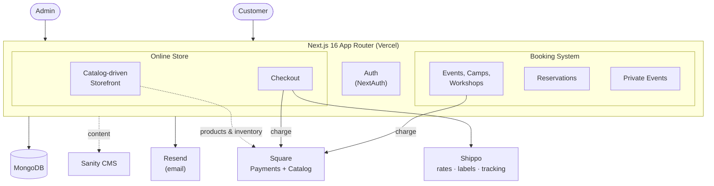

# Coastal Creations Studio

[](https://github.com/bcsurf2822/coastal-creations-app/actions/workflows/ci.yml)


Event booking + e-commerce platform for [Coastal Creations Studio](https://coastalcreationsstudio.com/),
an art studio in Ocean City, NJ. Two independent systems share one Next.js codebase: a class/camp/private-event
**booking platform**, and a Square-catalog-driven **online store** with live Shippo shipping.

## Table of Contents

- [About](#about)
- [Features](#features)
- [Architecture](#architecture)
- [Tech Stack](#tech-stack)
- [Getting Started](#getting-started)
- [Testing](#testing)
- [Deployment](#deployment)
- [Documentation](#documentation)
- [Studio Information](#studio-information)
- [License](#license)

## About

Coastal Creations Studio is a vibrant art studio owned by Ashley Mathers, offering creative classes,
workshops, camps, and private/birthday parties for all ages. This repo is the studio's full web platform:
the public marketing site, the booking system customers use to register and pay for classes/reservations,
an online store for physical products (art kits and more), and the admin dashboard Ashley's team runs both from.

## Features

**Customer-facing**
- Browse and book adult classes, kid classes, camps, live-artist events, and private parties, with Square-powered payment
- Day-by-day **reservations** for walk-in offerings (mosaics, canvas mixed media, art kits)
- **Online store**: a Square-catalog-driven shop with live Shippo shipping rates, gift-card redemption, and saved cards on file
- **Gift cards** — purchase, check balance, and apply at *any* checkout (events, store, reservations)
- Optional customer accounts (Google OAuth or passwordless magic link) to track past orders and bookings, with live shipment tracking
- Photo gallery, blog, and CMS-managed content pages (Sanity)

**Admin**
- Event, reservation, and private-event management (create/edit/cancel, view registered customers)
- Store product settings (parcel size for shipping) and a live-updating order dashboard with shipment tracking
- Payment monitoring, refund processing, and gift card administration
- Content management for page copy, business hours, and the photo gallery
- Role-based access (admin vs. customer) enforced in every route handler, not just the UI

## Architecture

Two independent systems share this codebase, one Next.js app, one MongoDB database — the booking system
never touches the store's data model or vice versa. Full technical map (data models, API routes, checkout
internals, auth): **[`AGENTS.md`](./AGENTS.md)**.


```mermaid
flowchart TB
    Customer(["Customer"]) --> Web
    Admin(["Admin"]) --> Web

    subgraph Web["Next.js 16 App Router (Vercel)"]
        direction LR
        subgraph Booking["Booking System"]
            EV["Events, Camps,\nWorkshops"]
            RES["Reservations"]
            PE["Private Events"]
        end
        subgraph StoreSys["Online Store"]
            CAT["Catalog-driven\nStorefront"]
            CO["Checkout"]
        end
        AuthN["Auth\n(NextAuth)"]
    end

    Web --> Mongo[("MongoDB")]
    EV -- charge --> Square["Square\nPayments + Catalog"]
    CO -- charge --> Square
    CAT -. products & inventory .-> Square
    CO --> Shippo["Shippo\nrates · labels · tracking"]
    Web -. content .-> Sanity["Sanity CMS"]
    Web --> Resend["Resend\n(email)"]
```

**Booking system** — Events/Reservations/Private Events are Mongoose models owned entirely by this app.
Checkout is server-orchestrated (`POST /api/checkout/booking`): recompute the price from the DB, charge
Square, redeem any gift card, write the booking, send confirmation — atomically, so a successful charge can
never leave an unbooked customer.

**Online store** — Square Catalog is the source of truth for products (name, price, photos, inventory); a
merchant sells an item online simply by adding it to a Square category named `"Online Sales - ..."`, no code
change. Checkout re-quotes shipping live from Shippo, recomputes the price server-side, charges Square,
auto-purchases the shipping label, and tracks the order to delivery via Shippo's webhook.

Both checkouts share one price-integrity rule: **client-supplied money is never trusted** — the server always
recomputes the charge from the database/catalog before charging a card.

## Tech Stack

| Layer | Choice |
|---|---|
| Framework | [Next.js 16](https://nextjs.org/) (App Router, Turbopack) + React 19 + TypeScript (strict) |
| Database | [MongoDB](https://www.mongodb.com/) via Mongoose |
| Styling | Tailwind CSS v4, a custom design-token system, + shadcn/ui (customer console only) |
| Auth | NextAuth v4 — Google OAuth + passwordless magic link, DB-backed roles |
| Payments | [Square](https://squareup.com/) — v44 native SDK (Payments + Catalog) + Web Payments SDK |
| Shipping | [Shippo](https://goshippo.com/) — live rates, label purchase, carrier tracking webhooks |
| CMS | [Sanity](https://www.sanity.io/) |
| Email | [Resend](https://resend.com/) (transactional + magic-link delivery) |
| Data fetching | TanStack Query |
| Testing | Vitest (unit/integration) + Playwright (e2e) |
| Hosting | [Vercel](https://vercel.com/) |

## Getting Started

**Prerequisites:** Node 20+, [pnpm](https://pnpm.io/) (pinned via `packageManager`, use via `corepack enable`).

```bash
git clone https://github.com/bcsurf2822/coastal-creations-app.git
cd coastal-creations-app
pnpm install --frozen-lockfile

cp .env.example .env   # fill in real values — see AGENTS.md → Configuration for every variable
pnpm run dev            # http://localhost:3000
```

The full list of required environment variables (MongoDB, Square, Shippo, Sanity, Resend, auth) is
documented in [`AGENTS.md` → Configuration](./AGENTS.md#configuration).

## Testing

```bash
pnpm run lint            # ESLint
pnpm run typecheck       # tsc --noEmit
pnpm run test:run        # Vitest — unit + integration
pnpm run test:coverage   # Vitest with coverage
pnpm run test:e2e        # Playwright e2e (starts against a local build)
```

CI (`.github/workflows/ci.yml`) runs lint, typecheck, unit/integration tests, and a production build on
every PR into `develop`/`main`; e2e runs in a separate job.

## Deployment

- **`main`** → production, auto-deployed by Vercel to [coastalcreationsstudio.com](https://coastalcreationsstudio.com/).
- **`develop`** → integration branch; every push gets a Vercel preview deployment.
- No branch pushes directly to `main` or `develop` — see [`AGENTS.md` → Git Workflow](./AGENTS.md#git-workflow)
  for the branch/PR convention.

## Documentation

- **[`AGENTS.md`](./AGENTS.md)** — the full technical map: architecture, data models, API routes, checkout
  internals, auth, design system. Start here for anything beyond a quick orientation.
- **`ecommerce/`** — sales tax research and the owner sign-off record.
- **`archive/ecommerce/`** — the original store build's ticket-by-ticket spec (shipping, price integrity,
  parcel sizing, hardening) — historical reference for *why* the store works the way it does.

## Studio Information

**Coastal Creations Studio**  
411 E 8th Street  
Ocean City, NJ 08226  
Owner: Ashley Mathers

Live site: [coastalcreationsstudio.com](https://coastalcreationsstudio.com/)

## License

Copyright © 2025–2026 Coastal Creations Studio. All rights reserved. Proprietary — not licensed for reuse.
