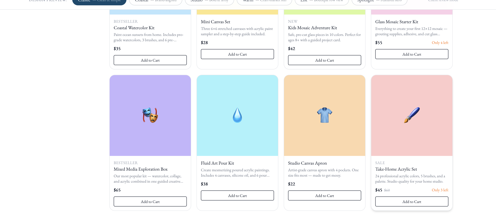
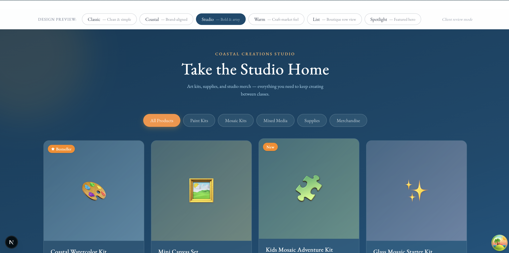

# Review / TODO

## 1. FIRST: Next.js 16 + React 19 upgrade — do this after pulling `david`

`develop` (now merged into `david`) upgrades the app from Next 15.2.8 → **16.2.7** and
React 18 → **19**. After you `git pull`, you MUST:

1. **Run `pnpm install`** — the lockfile changed (React 19, Next 16, new transitive
   resolutions). You do **not** need to delete `node_modules`; `pnpm install` reconciles it
   in place. If anything looks off: `rm -rf node_modules && pnpm install`.

2. **Check your Node version** — Next 16 requires **Node ≥ 20.9**.

   ```bash
   node --version
   ```

   - Node 20.9+ / 22 / 24 → you're fine, no action.
   - Node 18 or older → **upgrade Node** (e.g. `nvm install 22 && nvm use 22`) or Next 16 won't run.

3. **Heads-up:** `pnpm lint` is now stricter (React 19 / React Compiler rules) — ~45 warnings,
   0 errors, non-blocking. Build/deploy are unaffected by these.

---

## 2. Fix the 2 type errors breaking the production build (Vercel `pnpm run build`)

`next build` runs a TypeScript check after compiling and **stops at the first error**, so
Vercel only shows one at a time. A full project type-check (`npx tsc --noEmit`) reveals
**two** errors in app code that block the build. Both are pre-existing in the store/checkout
feature and are **unrelated** to the Next 16 / React 19 upgrade (TypeScript 5.9.3,
`@types/react@19`, and `mongoose@8` are unchanged by the upgrade).

Verified locally: applying both fixes below makes `pnpm build` compile **and** type-check
cleanly (79/79 routes generated).

### Error 1 — `app/api/store/products/route.ts:16` (current Vercel blocker)

```
Type error: Conversion of type '(FlattenMaps<IStoreProductSettings> & Required<{ _id: ObjectId; }>
& { __v: number; })[]' to type 'IStoreProductSettings[]' may be a mistake because neither type
sufficiently overlaps with the other. If this was intentional, convert the expression to 'unknown' first.
```

- **Cause:** Mongoose `.lean()` returns a `FlattenMaps<...>` shape (includes `__v`, ObjectId `_id`,
  and a flattened `MongoClient` on nested types) that does not overlap enough with
  `IStoreProductSettings` for a direct `as` cast.
- **Fix (quick):**
  ```ts
  }).lean()) as unknown as IStoreProductSettings[];
  ```
- **Fix (cleaner):** type the query and drop the trailing cast:
  ```ts
  const settings = await StoreProductSettings.find({
    isOnlineSellable: true,
  }).lean<IStoreProductSettings[]>();
  ```

### Error 2 — `components/store/CheckoutForm.tsx:136` (next blocker, hidden behind Error 1)

```
Type error: Type 'null' is not assignable to type 'ReactElement<unknown, string | JSXElementConstructor<any>>'.
```

- **Cause:** the component is declared `(): ReactElement` (line 29) but early-returns `null`
  at line 136 (`if (items.length === 0 && !orderCompleted.current) return null;`).
  `null` is not assignable to `ReactElement`.
- **Fix:** widen the return type:
  ```ts
  export default function CheckoutForm(): ReactElement | null {
  ```

### How to reproduce locally

```bash
rm -rf .next            # match Vercel's clean build
pnpm build              # fails type-check on app/api/store/products/route.ts:16
# To enumerate ALL type errors at once instead of one-per-build:
npx tsc --noEmit
```

### Not build blockers (for reference)

- **`__tests__/*` type errors (~33):** `next build` does **not** type-check test files, so they
  do not fail the Vercel build (they do fail `npx tsc --noEmit` and should be cleaned up separately).
- **`.next/dev/types/validator.ts` "Cannot find module .../app/api/products/route.js":** a stale
  artifact from local `next dev` referencing a route removed when the store moved to Square. It does
  **not** occur in a clean build (`rm -rf .next`) and never appears on Vercel.

---

## 3. UI: "Add to Cart" buttons are uneven across product cards

On the store grid the **"Add to Cart" buttons do not line up** — they sit at different
vertical positions from card to card because product descriptions and price rows have
different heights. The buttons should be **even (aligned) across the row**.



- **Cause:** cards size to their content, so a shorter description pushes its button up
  relative to a taller neighbor.
- **Fix direction:** make each card a full-height flex column (`flex flex-col h-full`) and
  push the button to the bottom (e.g. `mt-auto` on the button, or wrap the body so the CTA
  is in a footer that sticks to the bottom). With equal-height cards in the grid, the CTAs
  will align across the row regardless of description length.

---

## 4. Show REAL product images in the `/store` grid (replace mock data)

### Background — why `/store` shows emoji placeholders today

`/store` → `components/store/Store.tsx` renders a **temporary design-preview** (variant
selector + `VariantA–F`). Every variant imports `MOCK_PRODUCTS` from
`components/store/mockProducts.ts`, which uses an `icon` (emoji) + `accentColor` (gradient).
That is the only reason you see placeholders — it's mock data, not a broken image pipeline.

The real pipeline already works end-to-end:
`useProducts()` → `/api/store/products` → Square catalog → `primaryImage.url` → `next/image`.

### Where the images come from

- **Production (the live client site):** items already have images in **production Square**.
  Once a variant is wired to `useProducts()`, production renders real photos automatically —
  **no seeding needed.**
- **Local sandbox dev:** the sandbox catalog had **no** images, so they were copied once from
  production (20 items, primary image each). No re-seeding is needed for normal work.

### Steps to make `/store` show real images

1. **Wire the chosen variant to live data** — use `components/store/variants/VariantBReal.tsx`
   as the worked template (it is `VariantB`/"Coastal" converted to real data). The changes per
   variant:

   | Mock (`VariantX`)                      | Real (`useProducts()`)                                                              |
   | -------------------------------------- | ----------------------------------------------------------------------------------- |
   | `MOCK_PRODUCTS`                        | `const { data: products, isLoading, isError } = useProducts()` + states             |
   | emoji + `accentColor` block            | `<Image src={product.primaryImage.url} fill ... />` (+ "No image" fallback)         |
   | `$product.price` / `originalPrice`     | `formatPriceRange(product.priceRange)`                                              |
   | mock category enum + `CATEGORY_LABELS` | categories derived from real `product.categoryName`                                 |
   | `product.tag` (Bestseller/New/Sale)    | availability badge from `product.availability` (`available`/`low_stock`/`sold_out`) |
   | `product.description` on card          | **not available** in the list endpoint — see gap below                              |
   | `key={product.id}`                     | `key={product.squareItemId}`                                                        |

2. **Finalize `/store`** — once the client picks a variant, delete the selector in `Store.tsx`
   and render only the chosen (now real-data) variant. Wire the "Add to Cart" button to the
   real `CartProvider` (currently visual-only in the mock variants).

### Known gap to decide on

`StoreProductSummary` (the list endpoint) does **not** include `description` — only the
detail endpoint (`/api/store/products/[id]`) does. So card descriptions need a decision:
either add a short `description` to `/api/store/products` (in `toStoreProductSummary`,
`lib/utils/catalogHelpers.ts`), or drop descriptions from the cards. `VariantBReal.tsx` shows
the category name in that slot as a stand-in.

### Live previews in this branch

- `/store/preview-real` → the plain real `StoreGrid` (proves the data + images work).
- `/store/preview-coastal` → the Coastal design wired to real data (`VariantBReal`).

---

## 5. Store design consistency (applies to whichever variant is chosen)

### 5a. Price text must always be black — no color change

The variant cards render the price in the accent/orange color
(`style={{ color: "var(--color-accent)" }}`). Price should **always be black** — use
`var(--color-text-primary)` (`#111827`) — regardless of variant, tag, or sale state.
(The `VariantBReal.tsx` example in this branch has been set to black as the reference.)

### 5b. Page background must stay consistent across all pages

The page background is already defined globally in the layout —
`app/globals.css` → `body { background: var(--background); }` (currently `#ffffff`). Each
store variant overrides it with its own `background` on the `<section>` (e.g. the **Studio**
variant uses a dark navy gradient — see screenshot — and Coastal a light-blue gradient).
This makes the store page's background inconsistent with the rest of the site.

**Fix:** remove the per-variant `background` style on the `<section>` and let the global
layout background show through, so every page matches. (Card separation comes from each
card's shadow, not the page background.)


